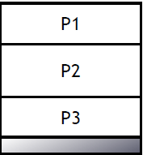
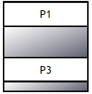
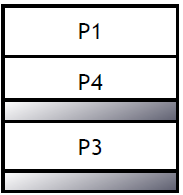
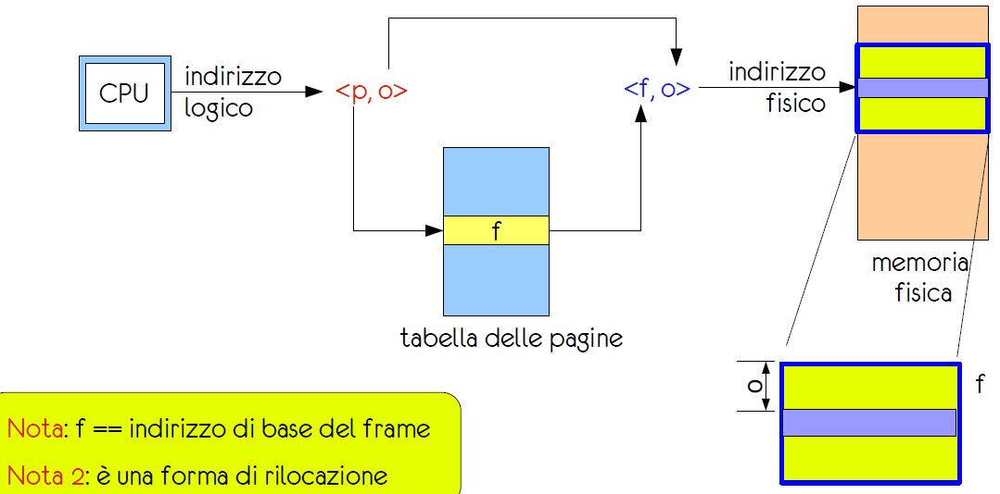
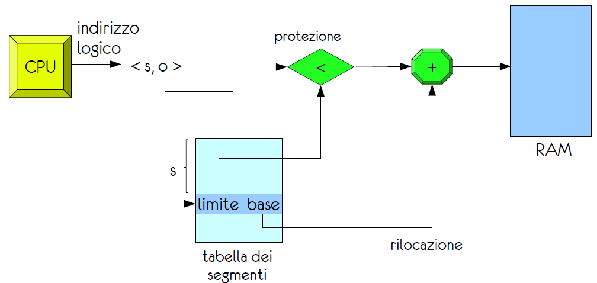

# Memorizzazione dei Processi

## Indirizzi Fisici e Virtuali

### Indirizzi Fisici

Per ogni processo vengono individuati due indirizzi fisici:
- **Indirizzo Base**: Indirizzo fisico iniziale del processo
- **Limite**: Indirizzo fisico finale del processo
  
Quando un porcesso viene eseguito la cpu confronta l'indirizzo fisico prodotto con quelli del processo per verificare che non vengano superati i limiti.

### Compilazione

Le variabili all'interno del codice vengono sostituite con indirizzi esatti, si generano quindi i moduli oggetto al cui interno vengono sostituiti indirizzi precisi con un notazione relativa, verrano poi collegati(**Linker**) per formare il programma eseguibile. Una volta caricato in memoria il programma verranno assegnati indirizzi reali.

### Binding

Parliamo di **Binding Statico** quando gli indirizzi vengono assegnati in fase di compilazione, se essi vengono assegnati in fase di esecuzione parliamo di **Binding Dinamico**. Nel secondo caso il binding è a carico della MMU che trasforma gli indirizzi virtuali in fisici, procurando procedure solo nel caso in cui non siano già presenti in memoria. I collegamenti dinamici vengono effettuati tramite l'utilizzo di STUB.

## Allocazione della Memoria

### Allocazione Contiugua

Con allocazione contigua indico la possibilità di assegnare un blocco di memoria ad un processo, in modo che esso sia contiguo. Questo metodo è molto semplice ma presenta dei problemi:

- **Frammentazione Esterna**: Si creano spazi vuoti tra i processi nel momento in cui essi vengono disallocati.

 
- **Frammentazione Interna**: Si creano spazi vuoti all'interno del blocco di memoria assegnato al processo.

Esistono 3 politicche di allocazione contigua:
- **First Fit**: Assegna il primo blocco di memoria disponibile che soddisfa le richieste del processo.
- **Best Fit**: Assegna il blocco di memoria più piccolo che soddisfa le richieste del processo.
- **Worst Fit**: Assegna il blocco di memoria più grande che soddisfa le richieste del processo.

### Paginazione

Con paginazione intendiamo un metodo di allocazione di memoria non contigua che permette un'allocazione dinamica delle risorse. 

Divido la ram in memoria fisica e memoria logica, la memoria logica è divisa in **pagine** di dimensione fissa, mentre la memoria fisica è divisa in **frame** di dimensione uguale a quella delle **pagine**.

Gli **Indirizzi Logici** sono costituiti da una coppid di valori$<numero\space di\space pagina, offset>$ mentre gli **Indirizzi Fisici** sono costituiti da una coppia di valori$<numero\space di\space frame, offset>$. Questi valori corrispondono tra loro all'interno di una **tabella delle pagine**.

### TLB
Cache che memorizza le corrispondenze tra indirizzi logici e fisici, permettendo di velocizzare le operazioni di traduzione. E' caricata in RAM e viene utilizzata per velocizzare le operazioni di traduzione.

La **TLB** si tro

$Hit\space Ratio = 82\%$
$RAM\space Access\space Time = 100ns$
$TLB\space Access\space Time = 20ns$

$T_{tlb} = access\space TLB + access\space RAM = 20 + 100 = 120ns$

$T_{pt} = 2*access\space RAM = 200ns$

$TempoAccessoMedio = (0.82*T_{tlb}) + (0.2*T_{pt}) = (0.82*120) + (0.2*200) = 134,4 ns$

In sistemi a con architattura a pochi BIT utilizzeremo la **paginazione multilivello** usando quindi una struttura ad albero. Serviranno quindi *n* variabili + offeset quanti sono i livelli dell'albero.

### Segmentazione

La segmentazione è un metodo di allocazione di memoria non contigua che permette di dividere la memoria in segmenti di dimensione variabile. Ogni segmento è associato ad un indirizzo limite e ad un indirizzo base.

Introduco quindi una **tabella dei segmenti** che contiene per ogni segmento il suo indirizzo base e la sua dimensione. Nel cercare un segmento la cpu dovrà cercare il segmento all'interno della tabella, una volta trovato l'indirizzo base sarà sufficiente sommare l'offset per ottenere l'indirizzo fisico. Nel caso in cui il codice cerchi di accedere a dati al di fuori del suo segmento verrà generato un **seg-fault**.

